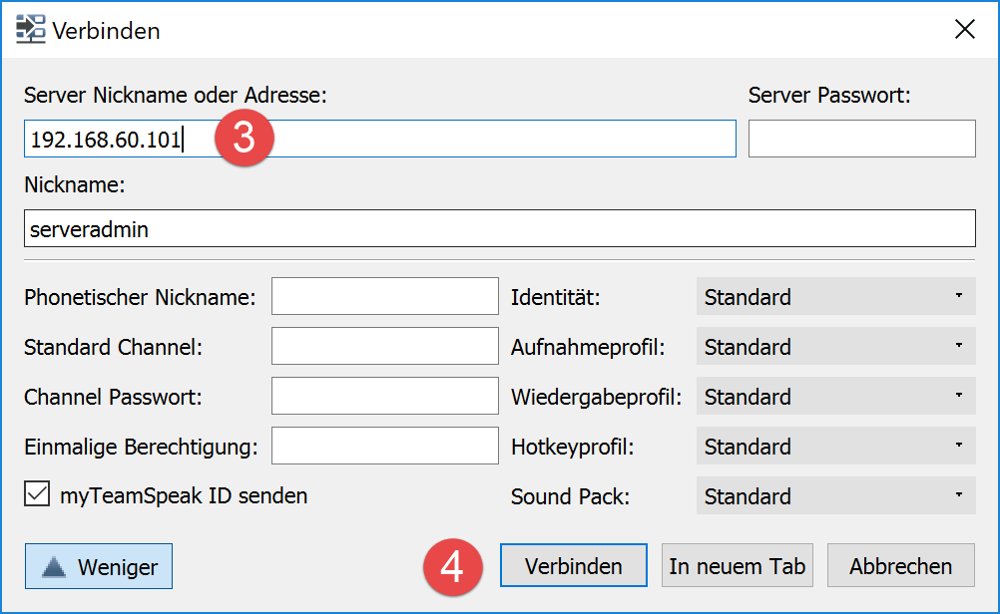
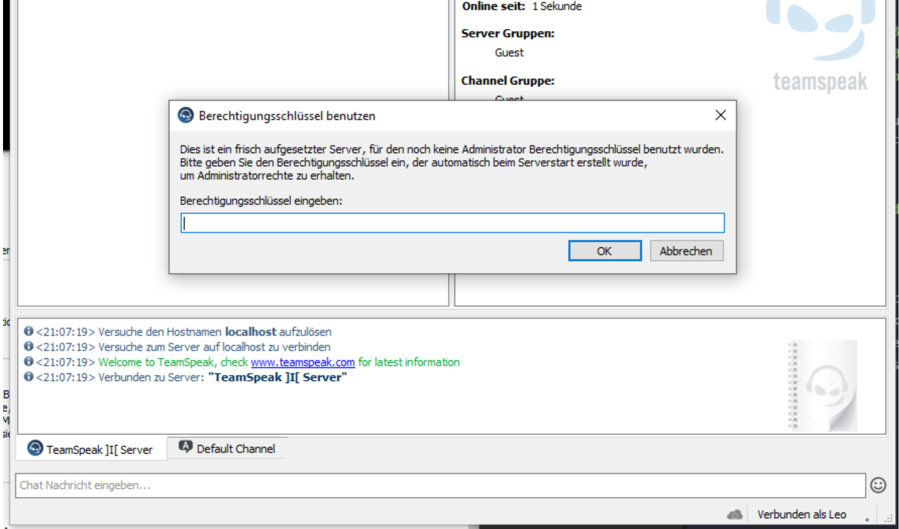

# LB02 von Azem Abdi

## Auftrag
---


### Idee für die LB02


### Informationen
[1]: https://docs.google.com/document/d/1M-aswL3k4uI-_MYO8RLX7ExAFEzVJkUoqjAOLj9gtyY/edit
[2]: https://bscw.tbz.ch/bscw/bscw.cgi/25833849
[3]: https://github.com/azemabdi/myM300
[4]: https://docs.docker.com/samples/library/teamspeak/
[5]: https://docs.docker.com/compose/install/

Alle Unterlagen befinden sich im [BSCW-M300][3] Folder. Noch mehr Informationen finden sie im [Fächertagebuch][1] vom M300.
Dieses Dokument wurde mit [Markdown][2] geschrieben

### Nützliche Links
* [TBZ][1]
* [BSCW][2]
* [Mein Repository][3]
* [TeamSpeak Installation][4]
* [Docker Compose][5]

## Netzwerkplan


## Vorbereitung
---
Wir haben uns entschieden einen neuen Service für die LB02 zu installieren, da wir bei der LB01 sehr viel Mühe hatten. Wir machen:
- TeamSpeak

Für das ganze brauchen wir ein Linux System. Mit unserem Vagrantfile, dass unter LB02/docker/teamspeak/Vagrantfile liegt, werden wir unser TeamSpeak installieren. Dort sind alle nötigen Einrichtungen gemacht die unser System braucht.

Alle Dateien sind in diesem Repository: https://github.com/azemabdi/myM300

Work Directory: M300-Services\docker\LB02

Voraussetzung:
- Virtuelle Maschine mit Linux (MyM300/docker/LB02/docker/teamspeak/Vagrantfile)
- TeamSpeak Ordner (MyM300/docker/LB02/docker/teamspeak/)

Im TeamSpeak Ordner sind alle nötigen Datei die wir brauchen:
- Vagrant
- docker-compose.yml
- Dockerfile
- get-version.sh
- start-teamspeak3.sh

Den Ordner "MyM300\docker\LB02\docker\teamspeak" müssen wir kopieren.
Den Speicherort können Sie eigentlich selber wählen, ausser Sie laden das ganze Repository herunter. Bei den Aufgaben müssen Sie dann auf die Pfade achten, diese könnten nicht mehr stimmen. Ich gehe immer vom Teamspeak Ordner aus!!!!

## Installations Ablauf
---
1. Vagrantfile ausführen
```
vagrant up
```
2. Wenn die VM fertig eingerichtet ist, per SSH mit der VM verbinden
```
vagrant ssh
```
3. In das richtige Verzeichnis wechseln, wo das Dockerfile ist
```
cd /vagrant
```
4. Nun bilden wir einen Image für unsere Dienste (dies aus dem Grund, dass wir nacher mit Doker-Compose arbeiten können)
```
cd /vagrant
```
```
docker build -t tslb02 .
```
Nun führen wir entweder das Dockerfile aus mit den nötigen Parameter (5.) oder wir führen das Docker-Compose file aus in dem die Parameter enthalten sind (6.)

5. Dockerfile ausführen damit wir dies in userem Image haben.
```
docker run -d -e TS3SERVER_LICENSE=accept -p 9987:9987/udp -p 10011:10011 -p 30033:30033 --name=ts3-server tslb02
```
6. Oder wir führen unser Dienst aus per Docker-Compose. In diesem File sind alle nötigen Parameter vorhanden.
```
docker-compose up -d
```

## Testing
Sobald die Installation erfolgreicht durchgelaufen ist, können wir das Ganze testen. Dies testen wir mit dem TeamSpeak3 Client auf einem Client. Dafür muss man TeamSpeak3 tnstallieren.

1. TeamSpeak3 starten


2. Verbindung starten



Erscheint die Meldung, dass ein Berechtigungsschlüssel eingegeben werden muss, ist die Verbindung erfolgreich. Hat man den Berechtigungsschlüssel nicht, kann man einfach auf **Abbrechen** und man ist mit dem TeamSpeak Server verbunden.


